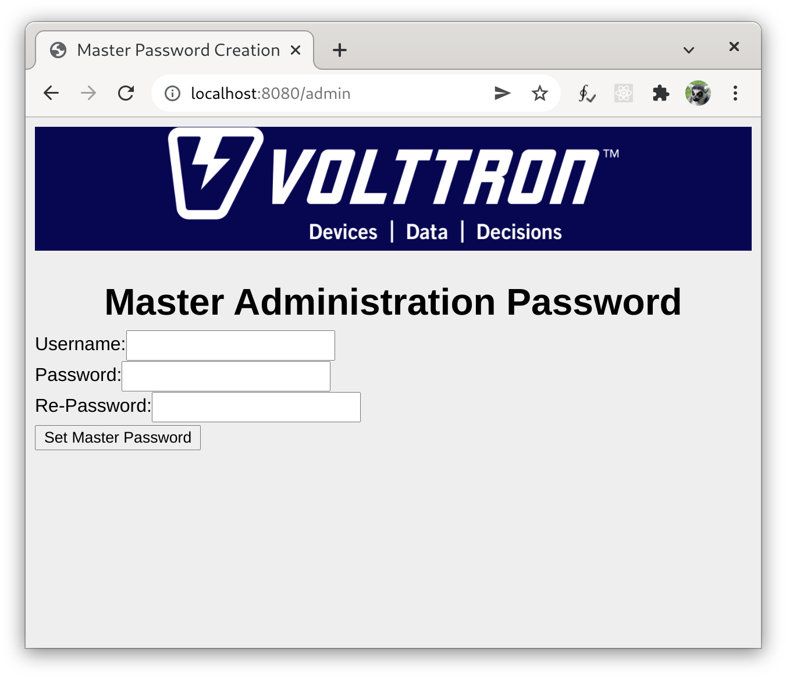
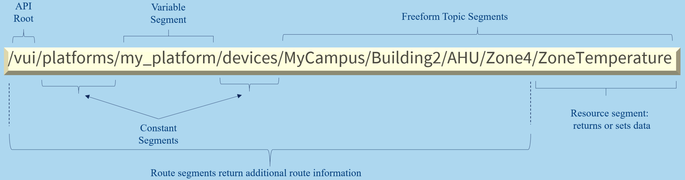

.. _Web-API:

======================================
RESTful Web Interface
======================================

The VOLTTRON User Interface API (VUI) is provided by the VOLTTRON Web Service, and is
intended to provide capabilities for building fully featured frontend applications.
The VUI is a RESTful HTTP API for communicating with components of the VOLTTRON system.

Installation
------------
The VUI is a built-in part of the VOLTTRON Web Service. To enable to VOLTTRON Web Service,
install the volttron-lib-web library:

.. code-block:: bash

    pip install volttron-lib-web

Once the library is installed, VOLTTRON will not be able to start until the web service is configured.
Configurations for services, including this, reside in a service_config.yml file in the VOLTTRON_HOME directory
(by default ~/.volttron/service_config.yml). If this file does not already exist, create it.
To configure the web service, include the following:

.. code-block:: yaml

    volttron.services.web:
      enabled: true
      kwargs:
        bind_web_address: http://192.168.0.101:8080
        web_secret_key: some_string # If not using SSL.
        web_ssl_cert: /path/to/certificate # Path to the SSL certificate to be used by the web service.
        web_ssl_key: /path/to/key # Path to the SSL secret key file used by web service.

The value of the ``bound_web_address`` key represents address to which the platform web service listens
for HTTP(s) requests. Typical addresses would be ``https://<hostname_or_ip>:8443`` or
``http://<hostname_or_ip>:8080``, and will most often be the IP address of the host on which the web service
is installed. Setting the bind_web_address to 0.0.0.0 will bind to all interfaces on the machine. 127.0.0.1 or
localhost can be used if it is not desired for the web services to be reachable by other hosts.

.. Note::

    If a hostname is used, it must be resolvable for the service to work as expected.

The port number (after the colon) can be any port which is not bound to another service on the host mahcine.
80 or 8080 are common ports when not using SSL. 443 and 8443 are common ports to use when using SSL.

HTTPS is strongly recommended. If using SSL, both web_ssl_certificate and web_ssl_key are required
and web_secret_key should not be included. If SSL is not desired, provide a web_secret_key instead and remove the
lines for the web_ssl_cert and web_ssl_key. Any string can be used for the web_secret_key.

Additionally, in order to use many of the API endpoints, an instance name must be set in the VOLTTRON platform
configuration file in VOLTTRON_HOME (by default ~/.volttron/config).  If this file does not already exist, create it.
Ensure that it contains at least the following (where "my_instance_name" will be the name of this platform):

.. code-block:: ini

    [volttron]
    instance-name=my_instance_name

Finally, a user must be configured in the ``$VOLTTRON_HOME/web-users.json`` file to allow authentication to the API.
This file can be generated, if it does not exist, by navigating to `bind-web-address`/admin in a web browser and
creating a user and password:

.. code-block:: json

    {
    "my_user":{
        "hashed_password":"$argon2id$v=19$m=102400,t=2,p=8$tbb2PgdA6B3jnPOeUwrB+A$yGA2xYOXld+COq4opWbs3Q",
        "groups":["admin", "vui"]
        }
    }

Users with the "vui" claim in `groups` will now be able to use the API by sending requests
to endpoints with paths on `bind-web-address` beginning with `/vui`. For example, where `bind-web-address` has been
set to ``https://localhost:8443`` the following HTTP request (with a proper
:ref:`HTTP Authorization Header <Authentication-Endpoints>`) may be used to retrieve the root endpoint of the API:

::

    GET https://localhost:8443/vui/

Access to the API may be disabled by removing "vui" from the list of groups in ``$VOLTTRON_HOME/web-users.json`` for any user which should not have access
to the API.

Path Structure
---------------

Paths to endpoints consist of alternating constant and variable segments, and are designed
to be readable and discoverable:

Get requests to non-leaf nodes typically return a `route-options` JSON object which gives additional possible paths
within the API. For instance, a GET request send to the path `/vui` will return:

.. code-block:: json

    {
    "route_options": {
        "platforms": "/vui/platforms"
        }
    }

Available Endpoints
-------------------

Endpoints which are currently provided by the API are described in detail in the
following sections:

- :ref:`Authentication <Authentication-Endpoints>`: Endpoints for authenticating to the the API.
- :ref:`Platforms <Platforms-Endpoints>`: Endpoints for working with a particular platform.
    - :ref:`Agents <Platforms-Agents-Endpoints>`: Endpoints for working with agents on the platform.
        - :ref:`Configs <Platforms-Agents-Configs-Endpoints>`: Endpoints for managing the configuration store for agents
          on the platform.
        - :ref:`Enabled <Platforms-Agents-Enabled-Endpoints>`: Endpoints for enabling, disabling, and setting the
          start priority of agents on the platform.
        - :ref:`RPC <Platforms-Agents-Rpc-Endpoints>`: Endpoints allowing, discovery, inspection, and calling of
          remote procedure calls to agents running on the platform.
        - :ref:`Running <Platforms-Agents-Running-Endpoints>`: Endpoints for starting and stopping agents on the
          platform.
        - :ref:`Status <Platforms-Agents-Status-Endpoints>`: Endpoints for determining status information for agents
          running on the platform.
        - :ref:`Tag <Platforms-Agents-Tag-Endpoints>`: Endpoints for getting, setting, and deleting the tag of agents.
    - :ref:`Devices <Platforms-Devices-Endpoints>`: Endpoints for getting, setting, and resetting devices on the
      platform.
    - :ref:`Historians <Platforms-Historians-Endpoints>`: Endpoints for querying data from historians on the platform.
    - :ref:`Pubsub <Platforms-Pubsub-Endpoints>`: Endpoints for subscribing and publishing to the message bus on the
      platform.
    - :ref:`Status <Platforms-Status-Endpoints>`: Endpoints for determining and clearing the status of all agents on
      the platform.

 .. toctree::
    :hidden:

    Authentication <authentication-endpoints>
    Platforms <platform-endpoints>
